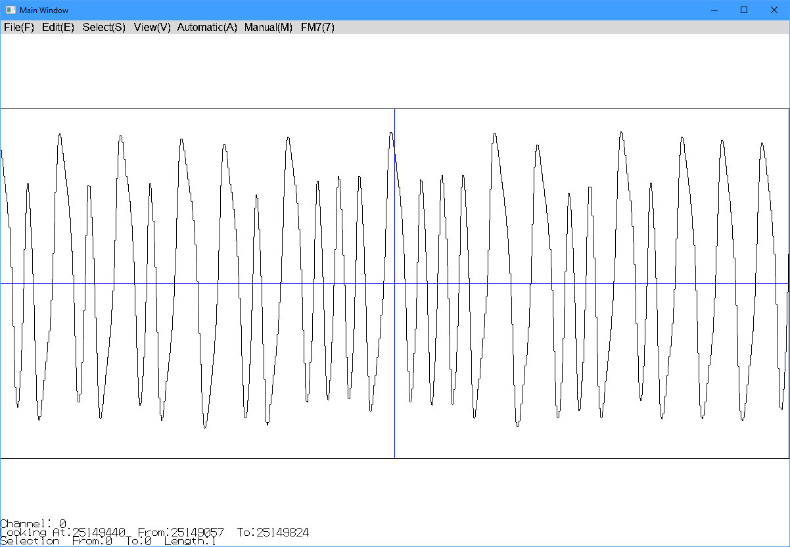
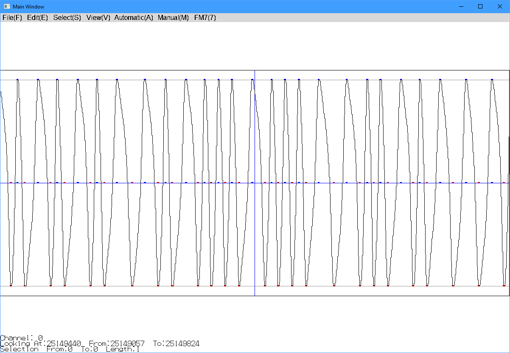

# FM-7 Tape Image Tool
## by CaptainYS (http://www.ysflight.com)
---

# Introduction
This program makes a .T77 tape image from 44.1KHz WAV sampling of FM-7 data (program) tape.

.T77 format file records duration of negative phases and positive phases of the wave.  However, the raw WAV recording typically have waves that are not appropriate for extracting information needed for .T77 format data.

For example, very often some waves are shifted to plus side or minus side.  If the wave is shifted to the plus side, the duration of the minus phase gets shorter and plus phase gets longer.

This program first applies sequence of the filters to re-shape the wave so that the necessary information can be more accurately extracted, and then recognize data bytes that FM-7 BIOS recognizes, and then re-encode the recognized data bytes to .T77 format file.
---

# はじめに
このプログラムは、44.1KHzで録音したWAV形式ファイルから、FM-7/77/77AVエミュレータで使用可能な.T77形式のテープイメージファイルを作成します。

.T77形式ファイルは、波がプラス側、マイナス側に振れている時間を記録します。しかし、WAV形式で録音した波は必ずしもそのデータの抜き出しに適していません。

例えば、多くの場合、波がプラス側かマイナス側にシフトしていることがあります。例えば、波がプラス側にシフトしていた場合、マイナス側のフェーズは短くなり、プラス側のフェーズが長くなります。

このプログラムは、最初にフィルターをかけて、波の形を整えて、正しい時間を計測しやすくします。その上で、FM-7のBIOSが認識するのと同じデータを抜き出して、そのデータを再エンコードすることで.T77形式ファイルを作成します。

**Before Filtering  フィルター前**

**After Filtering  フィルター後**

---
# Tips for Successful Imaging
Data/Program tapes are surprisingly durable.  I have a better success ratio of imaging tapes than imaging disks.  However, it is not as simple as reading and recording sectors.  There are some tips for successful imaging.

First, get a working data recorder.  Audio cassette players apply strange filter in order to make sound better for human ears, which is a bad idea for computer data.

A working data recorder is a must, although not easy to find.  I bought two data recorders from Yahoo! Auction.  None worked.  One said the motor worked.  It did, but no audio came out.  The second one the motor cannot play at constant speed.  Luckily one of my friends let me use his data recorder and said I can borrow it forever.  So, I am keeping it for the time being.  It is pricy, but I suggest to get one from a reliable retro source like Beep.

Then, use a light-weight WAV-recording program.

Audacity is very popular.  However, it is heavy and drops too many waves.  Missing one wave may not be audible to human ears.  But, it means one lost bit.  Losing one bit in a binary data kills the whole data.  Therefore I do not recommend Audacity for this purpose.

I have been using a free program called Lock On.  Which never dropped a single wave.  (https://hp.vector.co.jp/authors/VA014492/manual/help.htm)

Record FM-7 data/program tape stereo.  Don't force it to be monaural.  In my experience, left and right channels came with a small lag, but long enough to destroy waves when combined.  Record both left and right channels.  If you use a good data recorder, you probably see audio in only one of the two channels, which is good.

Seriously adjust the volume .  Do not saturate, but not too low volume.  I shoot for 70% of the maximum level.

---
# イメージ化成功のために
予想に反して、データ/プログラムテープはかなり安定で長持ちします。ディスクのイメージ化よりもテープのイメージ化の方がはるかに成功率が高いです。しかし、テープはセクターやフォーマット情報を読み込んで記録するのとは違って、注意点があります。

まず、使えるデータレコーダを確保してください。音楽用のカセットプレイヤーは人間の耳に音が良くなるようなフィルターをかけてしまいますが、データの取り出しに必要な波を破壊してしまいます。

とにかく、データレコーダは必須です。が、動作するデータレコーダを見つけるのは簡単ではありません。いままでふたつデータレコーダをヤフオクで落としましたが、ふたつとも使えませんでした。片方はモーターの動作は確認とあったのですが、モーターが動くだけで音が出ませんでした。もう一方はモーターの回転が安定しないようで、一定のレートでテープを再生することができませんでした。できれば、安いデータレコーダを落とすよりも、Beepなど信頼できる店から買う方が良いでしょう。

次に、軽量なWAV録音ソフトを使いましょう。

Audacityがこの手の話ではポピュラーですが、Audacityはあまりにも頻繁に波を取りこぼします。ひとつの波を取りこぼしても人間の耳にはほとんど聞こえないのでしょうが、データには致命的です。なので、データテープの録音にはAudacityはお勧めしません。

僕は、ロック音 (https://hp.vector.co.jp/authors/VA014492/manual/help.htm) というツールを長く使っています。このツールでは今までたったひとつの波も取りこぼしたことはありません。

それから、必ずステレオで録音しましょう。左右のチャンネルをまとめてモノラルにしたら失敗するかもしれません。僕が経験した現象では、左右のチャンネルが微妙にずれて入ってきたため、ややフェーズのずれた波が混じってしまって波形が認識不可能なほどの壊れてしまったことがあります。しかし、左右別に録音してみたら、そこそこ綺麗な波だったので、片方のチャンネルから.T77ファイル生成に成功しました。もっとも、これはまだデータレコーダが無くてオーディオ用のカセットプレイヤーを使っていたときの話ですが。もしも、状態の用意データレコーダを使ったら、片方のチャンネルのみに音が入ってくると思います。

レベル調整を真面目にしましょう。レベルが振り切れるようだと正しい音が取れません。が、あまりにもボリュームが低くてもデータの抜き出しは困難です。僕は大体レベルメーターで70%程度を狙って調整してから録音します。

---
# Basic Usage
If the recording is of reasonably good quality, the following steps should create a good .T77 tape image.

1. Open .WAV file from [File]->[Open]
2. Apply filter from [Automatic]->[Apply Filter]
3. Click [OK] and wait.
4. Select [FM7]->[FM7 Tape Dialog]
5. Click [Save T77 file] and select file.

Some games use non-standard encoding, which FM-7 BIOS cannot recognize, in which case use [Force Save T77] in step 5 instead of [Save T77 file].  If the emulator cannot load from the tape image, you can also try [Force Save T77].

# 基本的な使い方
.WAVファイルがある程度いい品質だった場合、次の手順で.T77ファイルを作成することができます。

1. [File]->[Open]から.WAVファイルを開く。
2. [Automatic]->[Apply Filter] を選ぶ。
3. [OK]ボタンを押して待つ。
4. [FM7]->[FM7 Tape Dialog]を選ぶ。
5. [Save T77 file]ボタンを押して、保存するファイル名を選択。

いくつかのゲームはFM-7のBIOSが使うのとは違ったエンコーディングを使っている場合があり、その場合、[Save T77 file]ではT77ファイルの生成に失敗します。その場合、ステップ5で[Force Save T77]を[Save T77 file]の代わりに選んでみてください。あるいは、エミュレータが.T77ファイルからロードできない場合も、[Force Save T77]を試してみてください。

